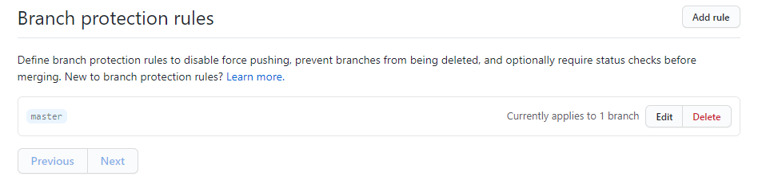

# Branch-test
Testing branches, pull, push, commit, etc. 

1. Clone remote repo (GitHub repo) to local repo (computer)

2. Added Activities for Creating, Protecting, Branching in GitHub to Branch-test

# Create a Repository

Create a Github repository and add group members as collaborators.

## Instructions

* One group member should create a new Github repository. Don't worry about the project name now, this can be changed later.

* From the repo's main page, click the "Settings" tab.

* Once in the repo's settings, select the "Collaborators" menu item on the left.

* From the "Collaborators" page, invite your group members to be project collaborators by entering their Github usernames one at a time.

* Each invited group member should receive an email they must open to accept the invitation.

# Students Do: Protect Master Branch

Protecting our repo's master branch. - this only needs to be used on the master branch, or any branches that will house finalized code.

## Instructions

* Navigate back to the repo's "Settings" page and then select "Branches" from the left sidebar.

* Under "Branches" select "Add rule"

* Branch name pattern: "master" (or name of the branch you want to apply the branch protection rules to)

* You should be presented with some options, check off the following:

* If completed successfully below image should appear and no one should be able to push directly to the master branch. Instead, all changes must be made in the form of pull requests that are to be reviewed by another group member.

# Git Branching/Pushing

Create a new branch, implement a feature, and then submit a pull request back into master. We will also cover reviewing pull requests and merging them into master. 
*A new branch will need to be created for each commit made to remote repo (GitHub)*

# Instructions

## Part I: Branching and Submitting a Pull Request
#### Before you begin
--------
`new-branch` will be used as the branch name in the example below - replace with your branch name 
*once you have made and saved any changes to the directory you will follow these steps to push these changes to GitHub*
--------
* Navigate to your current working directory

* Run the following command in your terminal to create and checkout to a new branch:
    * "-b" creates the new branch
  `git checkout -b new-branch`
  
* You should now be on a new branch named "new-branch" In order to verify that this worked, run the following command in your terminal:

  `git branch`

* You should see two branches listed: `master` and `new-branch`. The `new-branch` branch should have an asterisk to the left of it. This indicates that this is the branch you're currently on.

* In your terminal, add `git add -A` "-A" selects all, and commit `git commit -m "<message>"` the changes. Then push up your code by running following in your terminal:
    * "origin -branch name-" tells what branch to push to  
  `git push origin new-branch`

* This should push up your code to to GitHub on a branch with the same name (`new-branch`).

* Go to the main repo page at github.com and you should see an button that says "Compare & pull request." Click this.

* On the next screen, add a description of the work that was done in the text area and click the "Create pull request" button.

* If completed successfully, you should see the pull request listed under the repo's "Pull request" tab.

## Part II: Reviewing a Pull Request

* First, you will want to test the changes introduced by the `new-branch` branch locally (on your computer). To examine the new branch on your local machine, run the following commands in your terminal:
    * here you are pulling the code in from "new-branch" to run it on your computer to make sure it works properly before merging with the `master` branch
    * "fetch --all" pulls all of the code from the remote repo (GitHub) to your local repo (your computer)
  `git fetch --all`

  `git checkout new-branch`

* This code should bring the copy of the `new-branch` branch that's on GitHub onto your computer.

  * Normally you'd run the code here to make sure everything works properly.

* Check back out to your local `master` branch by running the following in your terminal:

  `git checkout master`

* Now go to your GitHub repo's main page and go to the "Pull request" section. Select the `new-branch` pull request from the list.

* At the next page select the option to see the "Files changed."

* You should be presented with all of the files that were changed in this PR along with line numbers for any code added or removed.

* If there are any changes you would like made, you can click the line number to leave a comment the PR author will see and should address before approval. Otherwise click "Review changes" and approve the PR. You should be taken to a screen with an option to "Merge pull request." Click this button.

* Once complete, you can delete the feature branch from your machine by running the following in your terminal:

  `git branch -D add-new-python-script`

* Ask an instructor or TA if you get stuck or have any questions!

### EXTRA NOTES
------
Default branch
The default branch is considered the “base” branch in your repository, against which all pull requests and code commits are automatically made, unless you specify a different branch.
The default branch is set to master. To change this setting, add another branch.
